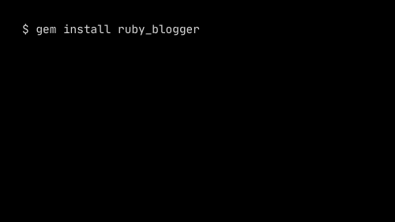
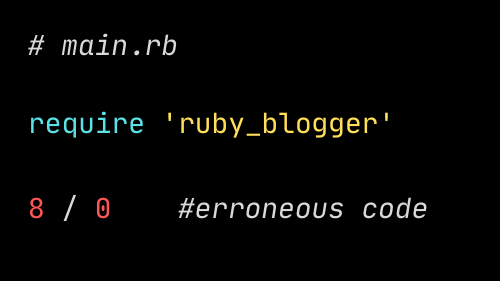
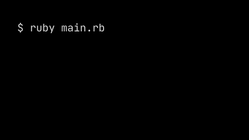

# Ruby Blogger

[](https://badge.fury.io/rb/ruby_blogger) 

### Introduction

Ruby Blogger is a simple exception tracker for all your `.rb` files. The command line tool makes it easy to read data on your raised exceptions. Read on to learn how to get started.

### Motivation

Ruby Blogger was created with beginners in mind. STDERR output can be an intimidating wall of text that's hard to understand. This gem is meant to help beginners understand exceptions more easily **and** see historical data about exceptions your file has raised over time, so you can focus on addressing the exceptions you encounter the most through a deliberative, informed process.

### Dependencies

`ruby 2.7.0` or higher

When you install `ruby_blogger`, an appropriate version of `yaml` and `rake` RubyGems will be downloaded and installed.

### Installation

At your command line, enter:

```
gem install ruby_blogger
```

You will see something like this:



### Usage

The `ruby_blogger` gem can be used to track exceptions raised by one, several, or all project files. To make sure `ruby_blogger` will track exceptions for a given file, it must be required at the top of that file.

#### To automatically track a file, add this one line at the top:

```ruby
require 'ruby_blogger'
```

For example, we have a file named `main.rb`:


And work as you would normally. Each time an exception is raised, you'll get a confirmation that the logging was successful:

```
'Bug Logged Successfully:'
```

Followed by the usual `STDERR` output.

Following the exmple with `main.rb`:


#### To review exceptions logged for all of your project files that require ruby_blogger, at your terminal, enter:

```
blog
```

Following the exmple with `main.rb`:


#### To review exceptions logged for one file that you specify, at your terminal, enter:

```
blog filename.rb
```

Following the exmple with `main.rb`:


### Contributing
Please open an [issue](https://github.com/aumi9292/blogger/issues) first, so we can discuss features and ensure pull requests will be fruitful. This project is open source and your [pull requests](https://github.com/aumi9292/blogger/pulls) are welcome. 

You will be listed as a contributor here (name and github profile).

#### First Pull Request?
Help us improve the [Exceptions Descriptions!](https://github.com/aumi9292/blogger/issues/17)

### Show your support
If this gem helped you, show your support by 🌟 it!

### Authors
- [Austin Miller](https://github.com/aumi9292)
- [Leena Lallmon](https://github.com/leena)
- [Mandy Cheang](https://github.com/mandysGit)

### License
Copyright (c) 2021 [MIT license](https://github.com/aumi9292/blogger/blob/master/LICENSE.txt)
